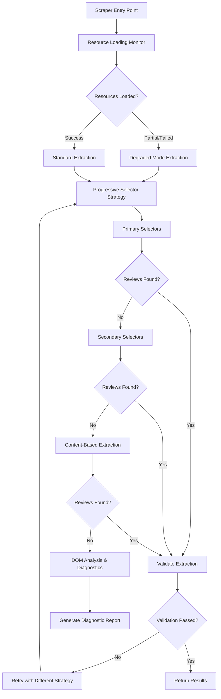

# Design Document

## Overview

The Google Maps scraper reliability enhancement addresses critical extraction failures where the scraper finds visual elements but fails to extract actual review content. The current issue manifests as finding star elements but zero rating elements, indicating a disconnect between element detection and content extraction.

The solution implements a multi-layered reliability framework:
1. **Resilient Resource Loading**: Handle network failures gracefully and continue extraction with available content
2. **Progressive Selector Strategies**: Multiple fallback approaches when primary selectors fail
3. **Content-Based Extraction**: Extract reviews based on content patterns rather than just CSS selectors
4. **Diagnostic Framework**: Comprehensive debugging to identify and resolve extraction issues
5. **Adaptive Interface Detection**: Handle different Google Maps layouts and versions

## Architecture

### Core Reliability Framework



### Resource Loading Monitor

A new `ResourceLoadingMonitor` will track page resource loading and provide fallback strategies:
- Monitor critical CSS and JavaScript loading
- Detect when essential review-related resources fail
- Provide degraded extraction modes when resources are unavailable
- Track loading performance and timeout issues

### Progressive Selector Engine

Enhanced selector strategy system that tries multiple approaches:
- **Primary**: Current working selectors optimized for latest Google Maps
- **Secondary**: Alternative selectors for different interface versions
- **Content-Based**: Pattern matching based on text content and structure
- **Brute-Force**: Comprehensive DOM scanning when specific selectors fail

## Components and Interfaces

### 1. Resource Loading Monitor

```typescript
interface ResourceLoadingResult {
  criticalResourcesLoaded: boolean;
  failedResources: string[];
  loadingTimeMs: number;
  degradedMode: boolean;
}

interface ResourceLoadingMonitor {
  monitorPageLoading(page: Page): Promise<ResourceLoadingResult>;
  waitForEssentialContent(page: Page, timeout: number): Promise<boolean>;
  detectDegradedMode(page: Page): Promise<boolean>;
}
```

### 2. Progressive Selector Engine

```typescript
interface SelectorStrategy {
  name: string;
  priority: number;
  selectors: SelectorSet;
  validator: (elements: Element[]) => boolean;
}

interface ProgressiveSelectorEngine {
  executeStrategies(page: Page): Promise<ExtractionResult>;
  validateExtraction(result: ExtractionResult): boolean;
  generateDiagnostics(page: Page, attempts: SelectorAttempt[]): DiagnosticReport;
}
```

### 3. Content-Based Extractor

```typescript
interface ContentPattern {
  type: 'author' | 'rating' | 'text' | 'date';
  pattern: RegExp;
  confidence: number;
}

interface ContentBasedExtractor {
  extractByContent(page: Page): Promise<RawReview[]>;
  identifyReviewPatterns(content: string): ContentPattern[];
  validateContentExtraction(reviews: RawReview[]): boolean;
}
```

### 4. Enhanced Diagnostic System

```typescript
interface DiagnosticReport {
  extractionAttempts: SelectorAttempt[];
  domAnalysis: DOMAnalysis;
  resourceStatus: ResourceLoadingResult;
  suggestedFixes: string[];
  debugScreenshot?: string;
}

interface DOMAnalysis {
  totalElements: number;
  reviewSectionFound: boolean;
  starElementsFound: number;
  ratingElementsFound: number;
  reviewTextElements: number;
  suspectedReviewContainers: Element[];
}
```

## Data Models

### Enhanced Extraction Result

```typescript
interface ExtractionResult {
  reviews: RawReview[];
  strategy: string;
  confidence: number;
  diagnostics: DiagnosticReport;
  extractionTimeMs: number;
  resourceLoadingResult: ResourceLoadingResult;
}
```

### Selector Attempt Tracking

```typescript
interface SelectorAttempt {
  strategy: string;
  selectors: string[];
  elementsFound: number;
  extractionSuccess: boolean;
  failureReason?: string;
  timeMs: number;
}
```

### DOM Analysis Details

```typescript
interface DOMAnalysis {
  pageStructure: {
    totalDivs: number;
    totalSpans: number;
    reviewContainers: number;
    starElements: number;
    ratingElements: number;
  };
  contentAnalysis: {
    hasReviewText: boolean;
    hasAuthorNames: boolean;
    hasDateElements: boolean;
    hasRatingNumbers: boolean;
  };
  interfaceDetection: {
    isMobile: boolean;
    isDesktop: boolean;
    version: string;
    language: string;
  };
}
```

## Error Handling

### Resource Loading Failures
- **Graceful Degradation**: Continue extraction with available DOM content
- **Retry Logic**: Attempt resource loading up to 3 times with exponential backoff
- **Fallback Modes**: Use simplified extraction when full resources unavailable

### Selector Strategy Failures
- **Progressive Fallback**: Try primary → secondary → content-based → brute-force
- **Validation Gates**: Validate each extraction attempt before proceeding
- **Strategy Learning**: Track which strategies work for different page types

### Network and Timeout Issues
- **Adaptive Timeouts**: Increase timeouts based on detected network conditions
- **Partial Content Handling**: Extract available reviews even if page loading incomplete
- **Connection Resilience**: Handle intermittent connectivity issues

## Testing Strategy

### Unit Tests
1. **Resource Loading Monitor Tests**
   - Test detection of failed resources
   - Test degraded mode activation
   - Test timeout handling and retry logic

2. **Progressive Selector Engine Tests**
   - Test strategy execution order
   - Test validation logic for each strategy
   - Test diagnostic generation

3. **Content-Based Extraction Tests**
   - Test pattern recognition for reviews
   - Test extraction without CSS selectors
   - Test confidence scoring

### Integration Tests
1. **Real Page Testing**
   - Test with pages that have resource loading issues
   - Test with different Google Maps interface versions
   - Test with partial content loading scenarios

2. **Reliability Scenarios**
   - Test extraction under network stress
   - Test with deliberately broken CSS/JS resources
   - Test timeout and retry mechanisms

### Performance Tests
1. **Resource Loading Performance**
   - Measure impact of monitoring on page load times
   - Test timeout effectiveness
   - Benchmark different extraction strategies

2. **Extraction Reliability**
   - Measure success rates across different strategies
   - Test diagnostic generation performance
   - Monitor memory usage during progressive attempts

## Implementation Phases

### Phase 1: Resource Loading Foundation
- Implement `ResourceLoadingMonitor`
- Add resource failure detection to existing scraper
- Create degraded mode extraction capabilities
- Add comprehensive resource loading diagnostics

### Phase 2: Progressive Selector Engine
- Implement multiple selector strategies
- Add validation logic for extraction results
- Create strategy execution framework
- Add diagnostic report generation

### Phase 3: Content-Based Extraction
- Implement pattern-based review extraction
- Add content analysis and validation
- Create fallback extraction methods
- Enhance diagnostic capabilities

### Phase 4: Testing and Optimization
- Implement comprehensive test suite
- Performance optimization and caching
- Real-world reliability testing
- Documentation and monitoring improvements

## Security Considerations

- **Resource Validation**: Validate loaded resources to prevent malicious content
- **DOM Sanitization**: Safely handle potentially malicious DOM content
- **Timeout Protection**: Prevent infinite loops in retry mechanisms
- **Memory Management**: Prevent memory leaks during progressive extraction attempts

## Monitoring and Observability

- **Extraction Success Rates**: Track success rates by strategy and page type
- **Resource Loading Metrics**: Monitor resource failure patterns
- **Strategy Effectiveness**: Track which strategies work best for different scenarios
- **Performance Impact**: Monitor extraction time and resource usage
- **Diagnostic Insights**: Analyze common failure patterns and suggest improvements

## Specific Solutions for Current Issues

### Star Elements vs Rating Elements Mismatch
- **Root Cause**: Visual star elements (★) are different from rating data elements
- **Solution**: Separate detection logic for visual stars vs. actual rating values
- **Implementation**: Enhanced selector strategies that distinguish between decorative and data elements

### Resource Loading Failures (net::ERR_FAILED)
- **Root Cause**: Google Maps relies on external resources that may fail to load
- **Solution**: Degraded mode extraction that works with minimal resources
- **Implementation**: Resource monitoring and fallback extraction strategies

### Low Extraction Success Despite Finding Elements
- **Root Cause**: Selectors find containers but not actual review content
- **Solution**: Content-based extraction that doesn't rely solely on CSS selectors
- **Implementation**: Pattern matching and text analysis for review identification