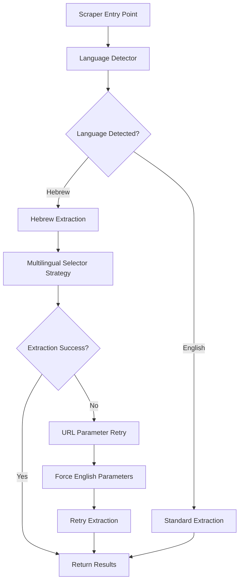

# Design Document

## Overview

The multilingual scraper fix addresses the critical issue where Google Maps serves pages in Hebrew based on geolocation rather than browser settings. The current scraper fails when encountering Hebrew interfaces because it relies on English-specific selectors and text patterns.

The solution implements a multi-layered approach:
1. **Language Detection**: Automatically detect the page language from DOM elements and text content
2. **Multilingual Selectors**: Use language-agnostic selectors and multilingual text patterns
3. **URL Parameter Forcing**: Attempt to force English language through URL parameters
4. **Fallback Strategies**: Progressive fallback from specific to general extraction methods

## Architecture

### Core Components



### Language Detection Service

A new `LanguageDetectionService` will be created to:
- Analyze DOM elements for language indicators
- Detect RTL (Right-to-Left) Hebrew language
- Identify Hebrew-specific UI elements and text patterns
- Cache language detection results per session

### Multilingual Extraction Engine

The existing extraction logic will be enhanced with:
- Language-agnostic selectors that work across different Google Maps interfaces
- Hebrew and English text pattern matching for author names, dates, and ratings
- Dynamic selector generation based on detected language
- Fallback extraction strategies when primary methods fail

## Components and Interfaces

### 1. Language Detection Interface

```typescript
interface LanguageDetectionResult {
  language: string;
  confidence: number;
  isRTL: boolean;
  detectedElements: string[];
}

interface LanguageDetector {
  detectPageLanguage(page: Page): Promise<LanguageDetectionResult>;
  isLanguageSupported(language: string): boolean;
  getLanguageSpecificSelectors(language: string): SelectorSet;
}
```

### 2. Multilingual Selector Sets

```typescript
interface SelectorSet {
  reviewsTab: string[];
  reviewContainer: string[];
  authorName: string[];
  rating: string[];
  reviewText: string[];
  date: string[];
}

interface MultilingualSelectors {
  english: SelectorSet;
  hebrew: SelectorSet;
  generic: SelectorSet;
}
```

### 3. Enhanced Scraper Service

The existing `GoogleReviewScraperService` will be extended with:

```typescript
interface EnhancedScraperService extends ReviewScraperService {
  detectAndHandleLanguage(page: Page): Promise<LanguageDetectionResult>;
  extractWithMultilingualSupport(page: Page, language: string): Promise<RawReview[]>;
  retryWithEnglishParameters(url: string): Promise<RawReview[]>;
}
```

## Data Models

### Language Detection Result

```typescript
interface LanguageDetectionResult {
  language: string;           // ISO language code (e.g., 'he', 'en')
  confidence: number;         // 0-1 confidence score
  isRTL: boolean;            // Right-to-left language flag
  detectedElements: string[]; // Array of detected language indicators
  suggestedSelectors: SelectorSet; // Language-specific selectors
}
```

### Enhanced Debug Information

```typescript
interface MultilingualDebugInfo {
  originalUrl: string;
  detectedLanguage: string;
  attemptedSelectors: string[];
  successfulSelectors: string[];
  extractionStrategy: string;
  fallbacksUsed: string[];
  finalExtractionCount: number;
}
```

## Error Handling

### Language Detection Errors
- **Fallback**: If language detection fails, assume English and use generic selectors
- **Logging**: Log detection failures with page content samples for debugging
- **Retry**: Attempt detection multiple times with different strategies

### Extraction Failures
- **Progressive Fallback**: Try language-specific → generic → brute-force extraction
- **URL Modification**: Retry with English language parameters (`&hl=en`)
- **Selector Expansion**: Use broader selectors when specific ones fail

### Network and Navigation Errors
- **Enhanced Timeout Handling**: Longer timeouts for non-English pages that may load slower
- **Resource Loading**: Handle failed font/resource loading for non-Latin scripts
- **Encoding Issues**: Properly handle UTF-8 encoding for multilingual content

## Testing Strategy

### Unit Tests
1. **Language Detection Tests**
   - Test detection accuracy for Hebrew and English pages
   - Test confidence scoring and RTL detection
   - Test selector generation for different languages

2. **Multilingual Extraction Tests**
   - Test author name extraction in Hebrew and English
   - Test date parsing for different language formats
   - Test rating extraction with multilingual aria-labels

3. **Fallback Strategy Tests**
   - Test URL parameter modification
   - Test progressive selector fallback
   - Test error handling and recovery

### Integration Tests
1. **Real Page Testing**
   - Test with actual Hebrew Google Maps pages
   - Test with mixed Hebrew-English content

2. **End-to-End Scenarios**
   - Test complete analysis workflow with multilingual pages
   - Test error recovery and retry mechanisms
   - Test performance with language detection overhead

### Performance Tests
1. **Language Detection Performance**
   - Measure detection time impact on overall scraping
   - Test caching effectiveness
   - Benchmark selector generation speed

2. **Memory Usage**
   - Monitor memory usage with multilingual selector sets
   - Test for memory leaks in retry scenarios
   - Optimize selector storage and retrieval

## Implementation Phases

### Phase 1: Language Detection Foundation
- Implement `LanguageDetectionService`
- Add language detection to existing scraper flow
- Create multilingual selector definitions
- Add comprehensive logging and debugging

### Phase 2: Multilingual Extraction Engine
- Enhance extraction methods with multilingual support
- Implement progressive fallback strategies
- Add URL parameter modification for English forcing
- Update error handling and retry logic

### Phase 3: Testing and Optimization
- Implement comprehensive test suite
- Performance optimization and caching
- Real-world testing with various languages
- Documentation and monitoring improvements

## Security Considerations

- **Input Validation**: Validate detected language codes to prevent injection
- **URL Modification**: Safely modify URLs without breaking security parameters
- **Resource Loading**: Handle potentially malicious font/resource requests
- **Content Sanitization**: Properly sanitize multilingual text content

## Monitoring and Observability

- **Language Detection Metrics**: Track detection accuracy and performance
- **Extraction Success Rates**: Monitor success rates by language
- **Fallback Usage**: Track which fallback strategies are most effective
- **Error Patterns**: Identify common failure patterns by language/region