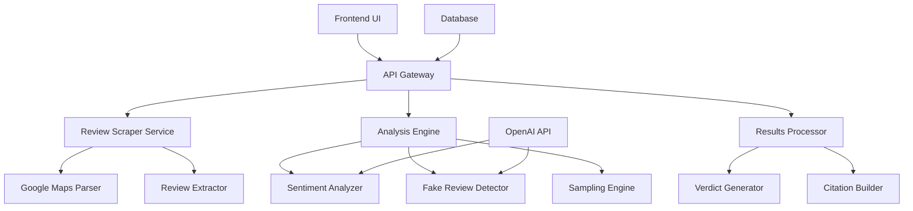

# Design Document

## Overview

Review.ai is a full-stack web application that analyzes Google Reviews to provide trustworthy business insights. The system uses a modular architecture with clear separation between scraping, processing, analysis, and presentation layers. The frontend provides real-time progress tracking while the backend handles web scraping, intelligent sampling, AI-powered sentiment analysis, and fake review detection.

## Architecture

### High-Level Architecture



### Technology Stack

**Frontend:**
- React with TypeScript for type safety
- Tailwind CSS for rapid UI development
- React Query for API state management
- WebSocket connection for real-time progress updates

**Backend:**
- Node.js with Express.js
- TypeScript for type safety
- Puppeteer for web scraping Google Maps
- OpenAI API for sentiment analysis and fake review detection
- WebSocket server for real-time communication
- SQLite for development, PostgreSQL for production

## Components and Interfaces

### 1. Frontend Components

#### ReviewAnalyzer Component
```typescript
interface ReviewAnalyzerProps {
  onAnalysisComplete: (results: AnalysisResults) => void;
}

interface AnalysisProgress {
  phase: 'scraping' | 'sampling' | 'sentiment' | 'fake-detection' | 'verdict';
  progress: number;
  message: string;
}
```

#### ResultsDashboard Component
```typescript
interface AnalysisResults {
  verdict: {
    overallScore: number;
    trustworthiness: number;
    redFlags: number;
  };
  sampling: {
    totalReviews: number;
    samplingUsed: boolean;
    sampleBreakdown?: SampleBreakdown;
  };
  analysis: {
    fakeReviewRatio: number;
    sentimentMismatchRatio: number;
    confidenceScore: number;
  };
  citations: ReviewCitation[];
}
```

### 2. Backend Services

#### Review Scraper Service
```typescript
interface ReviewScraperService {
  scrapeReviews(googleMapsUrl: string): Promise<RawReview[]>;
  validateUrl(url: string): boolean;
}

interface RawReview {
  id: string;
  author: string;
  rating: number;
  text: string;
  date: Date;
  originalUrl: string;
}
```

#### Sampling Engine
```typescript
interface SamplingEngine {
  shouldSample(reviews: RawReview[]): boolean;
  sampleReviews(reviews: RawReview[]): SampledReviews;
}

interface SampledReviews {
  reviews: RawReview[];
  breakdown: {
    recent: number;
    fivestar: number;
    onestar: number;
  };
  samplingUsed: boolean;
}
```

#### Analysis Engine
```typescript
interface AnalysisEngine {
  analyzeSentiment(reviews: RawReview[]): Promise<SentimentAnalysis[]>;
  detectFakeReviews(reviews: RawReview[]): Promise<FakeReviewAnalysis[]>;
}

interface SentimentAnalysis {
  reviewId: string;
  sentiment: 'positive' | 'negative' | 'neutral';
  confidence: number;
  mismatchDetected: boolean;
}

interface FakeReviewAnalysis {
  reviewId: string;
  isFake: boolean;
  confidence: number;
  reasons: string[];
}
```

## Data Models

### Review Model
```typescript
interface Review {
  id: string;
  author: string;
  rating: number;
  text: string;
  date: Date;
  originalUrl: string;
  sentiment?: SentimentAnalysis;
  fakeAnalysis?: FakeReviewAnalysis;
}
```

### Analysis Session Model
```typescript
interface AnalysisSession {
  id: string;
  googleMapsUrl: string;
  status: 'pending' | 'scraping' | 'analyzing' | 'complete' | 'error';
  progress: AnalysisProgress;
  results?: AnalysisResults;
  createdAt: Date;
  completedAt?: Date;
}
```

## Error Handling

### Scraping Errors
- **Invalid URL**: Return clear error message with URL format requirements
- **Access Denied**: Handle rate limiting and CAPTCHA challenges with retry logic
- **No Reviews Found**: Graceful handling when business has no reviews
- **Network Timeouts**: Implement exponential backoff retry strategy

### API Errors
- **OpenAI Rate Limits**: Queue requests and implement backoff
- **OpenAI API Failures**: Fallback to rule-based analysis for critical path
- **Malformed Responses**: Validate and sanitize all AI responses

### Frontend Error Handling
- **Network Failures**: Show retry options with clear error messages
- **Invalid Input**: Real-time validation with helpful guidance
- **Session Timeouts**: Automatic reconnection for WebSocket

## Testing Strategy

### Unit Testing
- **Scraper Service**: Mock Puppeteer responses, test URL validation
- **Sampling Engine**: Test sampling logic with various review counts
- **Analysis Engine**: Mock OpenAI responses, test sentiment/fake detection
- **Frontend Components**: Test user interactions and state management

### Integration Testing
- **API Endpoints**: Test complete request/response cycles
- **WebSocket Communication**: Test real-time progress updates
- **Database Operations**: Test data persistence and retrieval

### End-to-End Testing
- **Complete Analysis Flow**: Test from URL input to results display
- **Error Scenarios**: Test handling of various failure modes
- **Performance Testing**: Test with large review datasets

### AI Model Testing
- **Sentiment Analysis Accuracy**: Test against labeled review datasets
- **Fake Review Detection**: Validate against known fake review patterns
- **Confidence Calibration**: Ensure confidence scores correlate with accuracy

## Performance Considerations

### Scraping Optimization
- **Parallel Processing**: Scrape multiple review pages simultaneously
- **Caching**: Cache scraped data to avoid re-scraping during development
- **Rate Limiting**: Respect Google's rate limits to avoid blocking

### AI Processing Optimization
- **Batch Processing**: Send multiple reviews to OpenAI in single requests
- **Async Processing**: Use queues for non-blocking analysis
- **Result Caching**: Cache analysis results for identical review text

### Frontend Performance
- **Progressive Loading**: Show results as they become available
- **Virtual Scrolling**: Handle large citation lists efficiently
- **Optimistic Updates**: Update UI immediately for better UX

## Security Considerations

### Data Privacy
- **No Personal Data Storage**: Only store review text and metadata
- **Secure API Keys**: Environment variables for OpenAI credentials
- **HTTPS Only**: All communications encrypted in transit

### Input Validation
- **URL Sanitization**: Validate and sanitize all Google Maps URLs
- **XSS Prevention**: Sanitize all user-generated content display
- **Rate Limiting**: Prevent abuse of analysis endpoints

## Deployment Architecture

### Development Environment
- **Local Database**: SQLite for rapid development
- **Mock Services**: Optional mocks for OpenAI during development
- **Hot Reloading**: Fast development iteration

### Production Environment
- **Database**: PostgreSQL with connection pooling
- **Caching**: Redis for session and result caching
- **Load Balancing**: Handle multiple concurrent analyses
- **Monitoring**: Comprehensive logging and error tracking